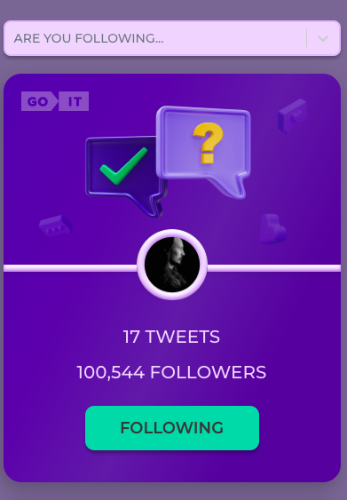
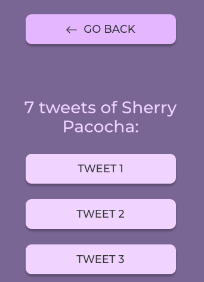
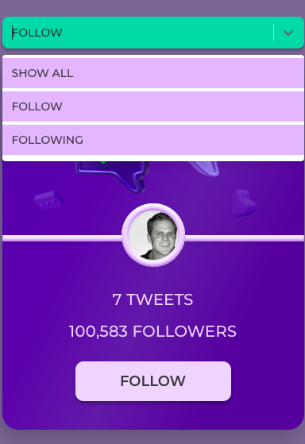

# TWEETCARD (тестове завдання)
## Мета: 
створити картки твітів та додати інтерактивності при клікові на кнопку

## Технічне завдання:
* Відповідно до [макету](https://www.figma.com/file/zun1oP6NmS2Lmgbcj6e1IG/Test?type=design&t=YNxucFjyzX6ZmYFK-6) потрібно реалізувати картки юзера.
* При клікові на кнопку Follow - текст змінюється на Following. Також змінюється колір кнопки. А до кількості фоловерів додається і ваш. Тобто, початкова кількість складає, наприклад, 100,500 фоловерів. При клікові на кнопку буде 100,501.
* Юзери мають бути створені в Mockapi з наступними полями: id, user, tweets, followers, avatar.
* При оновлені сторінки має фіксуватись кінцевий результат дій юзера. Тобто, якщо клікнути по кнопці і оновити сторінку - то кнопка все рівно залишається в стані Following із відповідним кольором, а кількість фоловерів НЕ зменшується до початкового значення.
При повторному клікові на кнопку її текст та колір змінюються до початкового стану. Також змінюється і кількість фоловерів. Вона зменшується на 1 (100,500).
* В коді цифра 100,500 має бути прописана одним значенням (100500). В UI - виведено через кому (100,500).
* Реалізація пагінації по 3 картки юзерів, підгрузка по кнопці "Load more".
* Створення маршрутизації, використовуючи React Router, за маршрутами "/" та "/tweets".
* Додавання фільтрації. Це має бути Dropdown із 3 опціями(оформлення на ваш розсуд): show all, follow, followings.

## Реалізація: 
* Home page є сторінкою з картками юзерів та кнопкою "LOAD MORE" для відображення по 3 картки юзерів.
 

* Tweets page - це сторінка, на яку можна перейти по посіланню "TWEETS", що відображене на картці кожного юзера. На цій сторінці рендериться схематичні твіти цього конкретного юзера, в кількості, що зазначена в його картці. Кнопка "GO BACK" повертає корістувача назад на домашню сторінку з юзерами.

* Опції фільтру реалізовані за статусом юзерів, яких на яких корістувач підписаний або ні. При зміні статусу у відфільтрованому списку картка юзера переміщується у список юзерів з іншим статусом.
Статус юзерів зберігається при оновленні сторінки.

## Технології:
* Створення проекту та деплой на GitHub: [Vitejs](https://vitejs.dev/guide/);
* Створення компонентів, управління станом: [React](https://legacy.reactjs.org/docs/getting-started.html), [React Redux](https://react-redux.js.org/introduction/getting-started);  
* Mаршрутизація: [React Router DOM](https://reactrouter.com/en/main);  
* Створення даних (mock-бекенд): [mockapi.io](https://mockapi.io/);  
* Запити на бекенд: [axios](https://www.npmjs.com/package/axios);  
* Збереження даних [redux-persist](https://www.npmjs.com/package/redux-persist);  
* Створення робочої копії даних для їх доповнення, відтворення стану без запитів на бекенд [immer](https://immerjs.github.io/immer/return/)(producers);  
* Dropdown [react-select](https://react-select.com/home#getting-started)
* Контроль типізації даних з [PropTypes](https://legacy.reactjs.org/docs/typechecking-with-proptypes.html)
* Стилізація - [CSS Modules Vitejs](https://vitejs.dev/guide/features.html#css)

